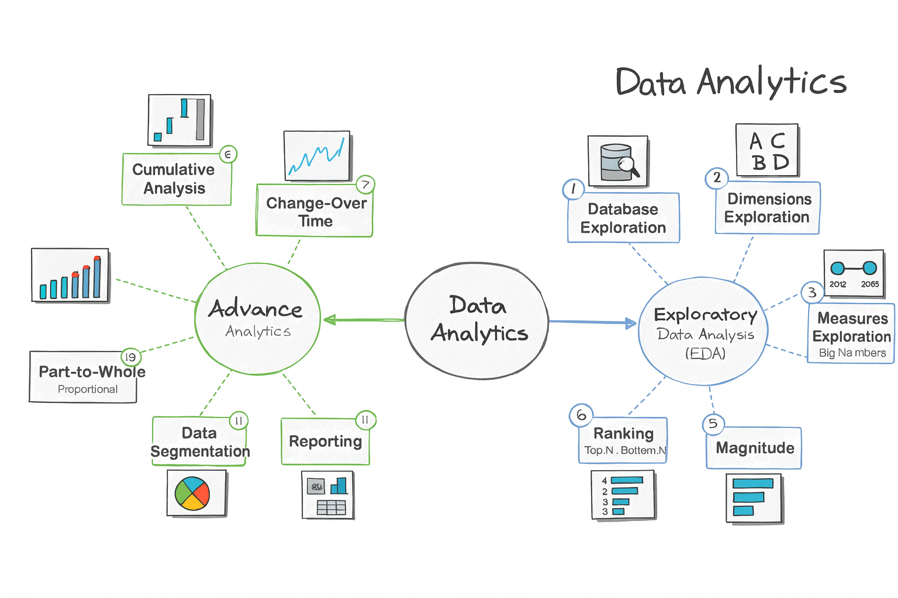

# SQL-Data-Analytics-Project
A comprehensive set of SQL scripts for data exploration, analytics, and reporting. These queries cover profiling, key metrics, time trends, cumulative analysis, and segmentation, providing analysts and BI professionals with ready-to-use examples that follow SQL best practices.

---

## Project Objectives

- Build a **library of SQL queries** for analytics and reporting.  
- Enable **data exploration** for understanding datasets.  
- Provide **business insights** using SQL queries on structured data.  
- Demonstrate **SQL best practices** in query design and optimization.  
- Act as a **portfolio-ready project** for showcasing SQL and analytics skills.  

---

## Features

This project is divided into **two main categories** of analytics:

### 1. Exploratory Data Analysis (EDA)
EDA helps analysts understand raw data before advanced modeling.  
The queries included here cover:

- **Database Exploration** → Identify tables, fields, and metadata.  
- **Dimensions Exploration** → Analyze categorical fields (e.g., region, product, department).  
- **Date Exploration** → Explore patterns across time periods (daily, monthly, yearly).  
- **Measures Exploration** → Work with numeric columns (sales, profit, counts).  
- **Magnitude Analysis** → Compare absolute values (biggest, smallest).  
- **Ranking** → Top-N and Bottom-N queries (e.g., top 10 customers, bottom 5 products).  

### 2. Advanced Analytics
Advanced analysis focuses on deriving **business insights** and **strategic metrics**.  
Queries included here are:

- **Cumulative Analysis** → Running totals, moving averages, cumulative sums.  
- **Change-Over-Time** → Month-over-month growth, year-over-year trends.  
- **Performance Analysis** → Compare actuals vs targets.  
- **Part-to-Whole Analysis** → Proportions, percentages, contribution analysis.  
- **Data Segmentation** → Customer or product segmentation by behavior.  
- **Reporting Queries** → Standard KPIs for dashboards and reports.  

